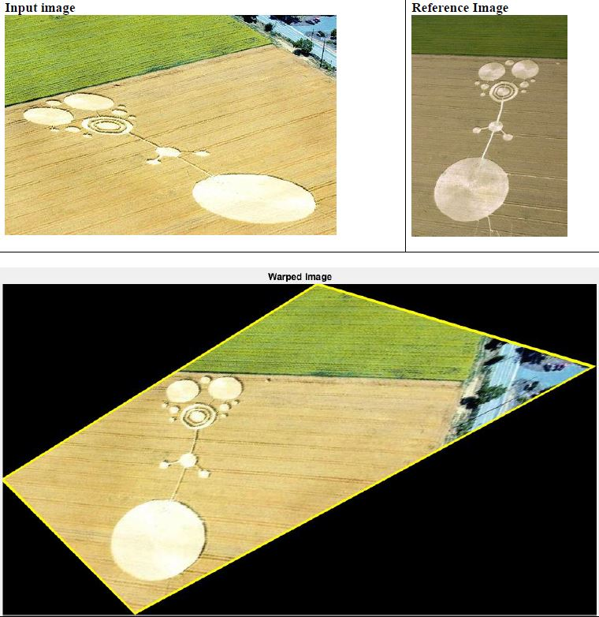

# Image-Mosaics
Warping and stitching two images using Homography matrix. Here, an image stitcher that uses image warping and homographies to automatically
create an image mosaic is implemented. We will focus on the case where we have two input images that should form the mosaic, where we warp one image into the plane of the second image and display the combined views.

# Examples
Displaying the input image, warped and merged images:

# File Summary

points.m: Script to choose corresponding points between two images and store the coordinates in a mat file

computeH.m: This function takes a set of corresponding image points t1, t2 (both t1 and t2 are 2xN matrices) and computes the associated 3 x 3 homography matrix H.

warpImage.m: This function takes as input an image inputIm, a reference image refIm, and a 3x3 homography matrix H, and returns 2 images as outputs. The first image is warpIm, which is the input image inputIm warped according to H to be in the frame of the reference image refIm. The second output image is mergeIm, a single mosaic image with a larger field of view containing both the input images. To avoid holes, an inverse warp is used. 
