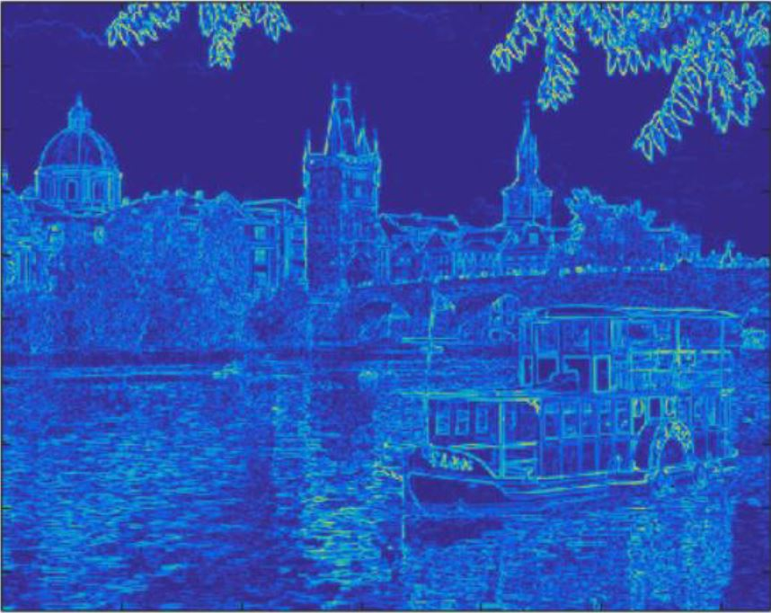
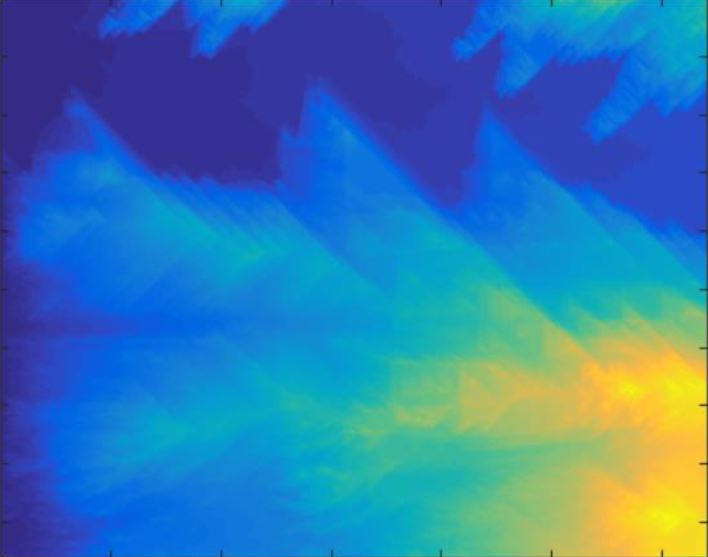
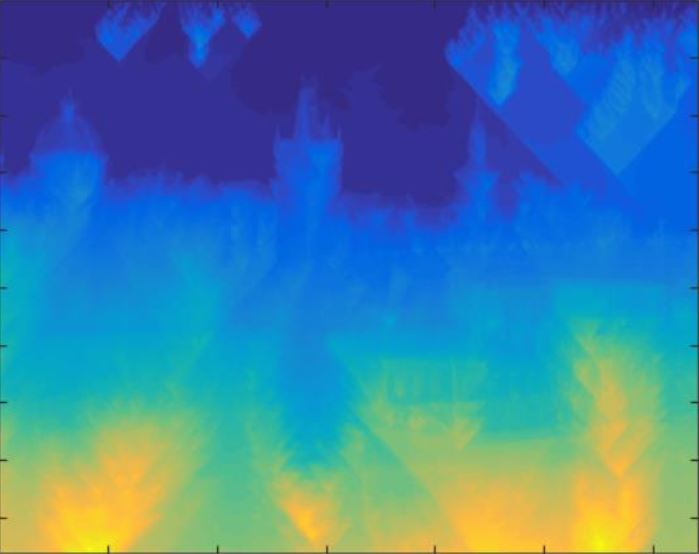
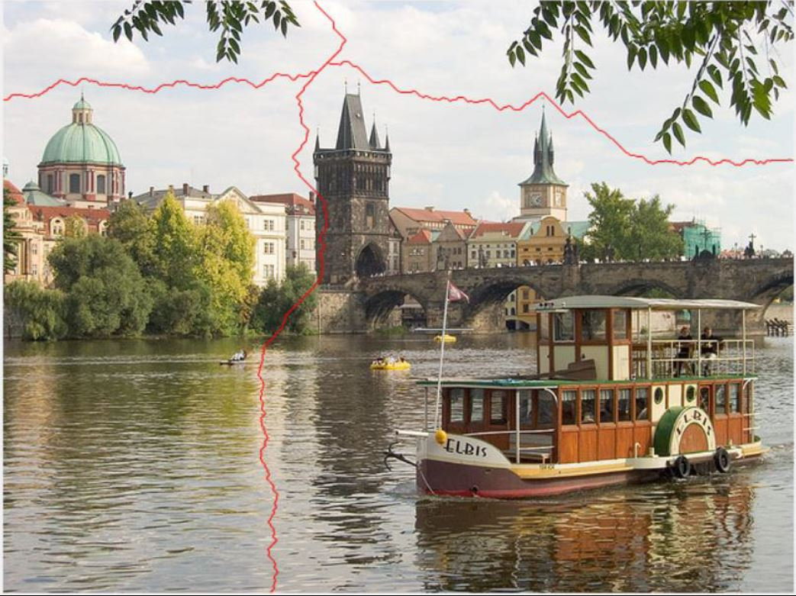
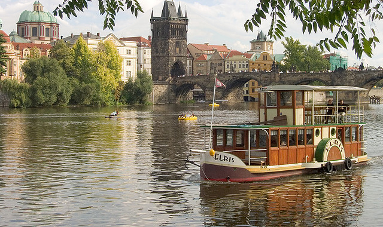

# intelligent-image-resizing
Program to resize an image while preserving objects of interest

## Credits
This is a project that implements the technique of content-aware image resizing as is described by Shai Avidan and Ariel Shamir’s SIGGRAPH 2007 paper, "Seam Carving for Content-Aware Image Resizing".

## Execution
The executable files to reduce height and width are SeamCarvingReduceHeight.m and SeamCarvingReduceWidth.m respectively. An example image has been provided. User can make changes to the selection of input images as well as the amount by which the height/width needs to be reduced. The output images will be displayed and saved to the current folder.

## Procedure
For an input image, its energy image is calculated. This energy image gives knowledge of edges or regions of change. Using this energy image, a cumulative minimum energy map is generated which shows the cumulative amount of change experienced in the horizontal or vertical direction. Using this image, an optimal vertical or horizontal seam is computed, which can be removed to produce the image with one seam removed. This process, when repeated over a loop, removes a bunch of seams to give a resized image.

## Examples
The example input image is given below:

Energy image produced:

Cumulative Minimum Energy Map in Horizontal and Vertical directions:

Output image showing optimal seams in vertical and horizontal directions

Width reduction by 100 seams

Height reduction by 100 seams

