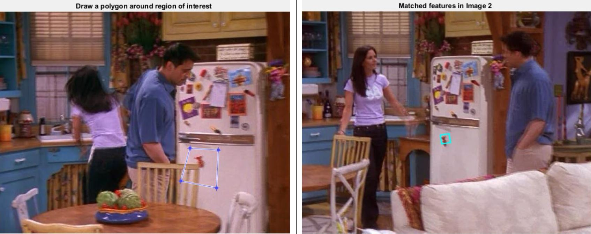
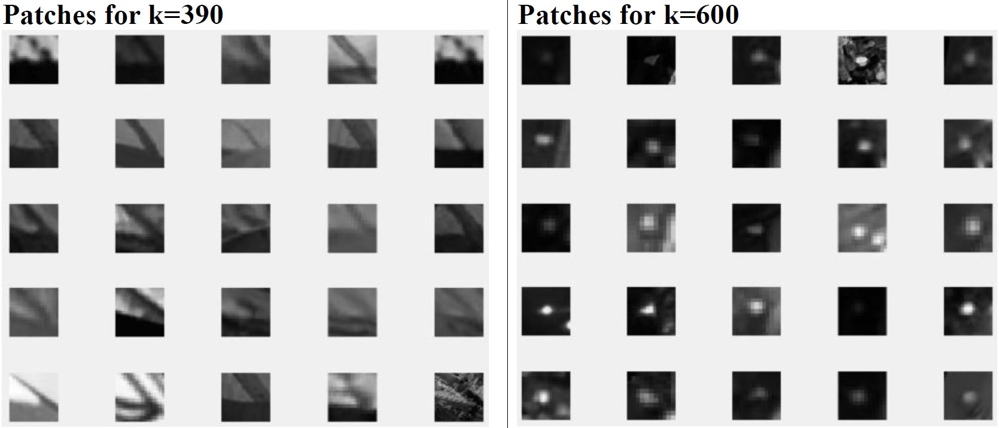
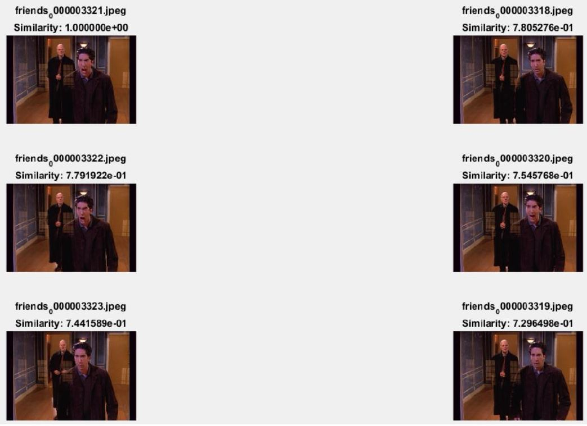
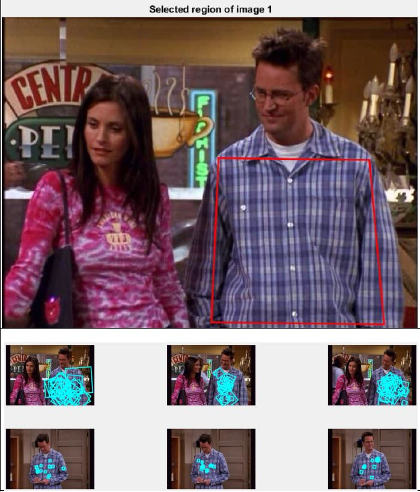

# Object-detection-across-multiple-frames
Object detection using descriptor matching and visual vocabulary. This is a video search method to retrieve relevant frames from a video
based on the features in a query region selected from some frame. 

# Provided Data
Download the data below:

Pre-Computed SIFT features
https://filebox.ece.vt.edu/~F13ECE5554/resources/PS4_material/PS4SIFT.zip

Associated Images
https://filebox.ece.vt.edu/~F13ECE5554/resources/PS4_material/PS4Frames.zip

Required Mat files
https://drive.google.com/open?id=1MUqrhIpDuLlW6PGNjlnis5bm7t9KhBtE

# Examples
SIFT features matched from the selected region of first image with the displayed SIFT feature in the second image:  

Visual vocabulary examples for 2 words:  

Top 5 most similar frames to the 1st image detected using bag of words histogram matching:  

Pattern detected in various other frames:  

# File summary
**provided_files:**

loadDataExample.m: Run this first and make sure you understand the data format. It is a script that
shows a loop of data files, and how to access each descriptor. It also shows how to use some of the
other functions below.

displaySIFTPatches.m: given SIFT descriptor info, it draws the patches on top of an image

getPatchFromSIFTParameters.m: given SIFT descriptor info, it extracts the image patch itself and
returns as a single image

selectRegion.m: given an image and list of feature positions, it allows a user to draw a polygon
showing a region of interest, and then returns the indices within the list of positions that fell within
the polygon.

dist2.m: a fast implementation of computing pairwise distances between two matrices for which each
row is a data point

kmeansML.m: a faster k-means implementation that takes the data points as columns.

**helper_files:**

bagOfWords.m: This function calculates the bag of words histograms for given image name and returns the histogram

similarityScore.m: Calculates Similarity Score of two bag of words histograms

storeHists.m: Script stores the bag of words histograms in a mat file

**Executables:**

rawDescriptorMatches.m: This script allows a user to select a region of interest in one frame, and then match descriptors in that region to descriptors in the second image based on Euclidean distance in SIFT space. The selected region is displayed.

visualizeVocabulary.m: This script uses a visual vocabulary and displays example image patches associated with two of the visual words. 

fullFrameQueries.m: In this script, 3 different frames are chosen from the entire video dataset to serve as queries. Then the M=5 most similar frames to each of these queries (in rank order)is displayed based on the normalized scalar product between their bag of words histograms. 

regionQueries.m: In this script, selected query regions from within 4 frames are used to demonstrate the retrieved frames when only a portion of the SIFT descriptors are used to form a bag of words.  

